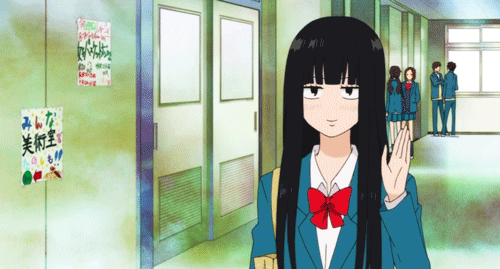

<!-- TITLE -->

  <ul align="center">
      
  </ul>

<!-- PRESENTATION -->

Estou cursando técnico em Desenvolvimento de Sistemas e, atualmente, mantenho foco nas linguagens Java e JavaScript. Possuo estudo constante ao meu alcance e procuro estar sempre por dentro das novidades do mundo tecnológico, o que tanto me fascina!

#

<!-- LINKS -->
<h3 align="left">Connect with me!</h3>

  

  
  
  

<!-- LANGUAGES -->
<h3 align="left">Technologies</h3>

  
  
  
  
  
  
  
  

#

<!-- GITHUB STATS -->
<h3 align="center">~ GitHub Stats ~</h3>

  

#
