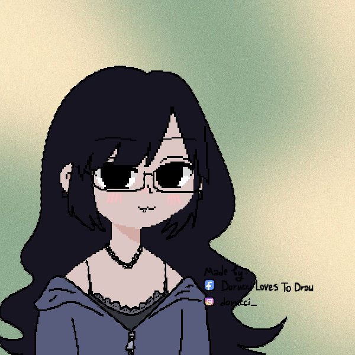

<!-- TITLE -->

  <ul align="left">
      
  
  </ul>

<!-- PRESENTATION -->

Estou cursando técnico em Desenvolvimento de Sistemas e, atualmente, mantenho foco nas linguagens Java e JavaScript. Possuo estudo constante ao meu alcance e procuro estar sempre por dentro das novidades do mundo tecnológico, o que tanto me fascina!

<!-- LINKS -->
<h3 align="left">Connect with me!</h3>

  

  
  
  

<!-- LANGUAGES -->
<h3 align="left">Used Languages</h3>

  
  
  
  
  
  

<!-- COMMIT SNAKE -->
<picture>
  <source media="(prefers-color-scheme: dark)" srcset="https://raw.githubusercontent.com/taina8/taina8/output/github-contribution-grid-snake-dark.svg">
  <source media="(prefers-color-scheme: light)" srcset="https://raw.githubusercontent.com//taina8/taina8/output/github-contribution-grid-snake.svg">
  
</picture>

  

 
  Image created by Dorucci on <a href="https://picrew.me/en/">picrew</a>.

